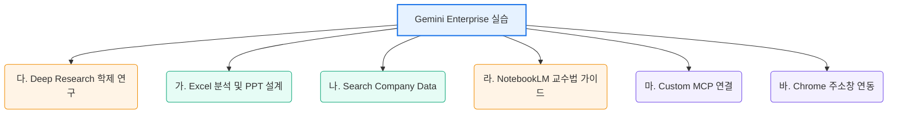

# 🎨 홍익대학교 교수와 임직원을 위한 Gemini Enterprise 실습 워크숍

> **본 저장소는 홍익대학교 교수진과 행정 임직원의 업무 생산성 혁신 및 교육·연구 역량 강화를 위해 설계된 Gemini Enterprise 핸즈온 워크숍 실습 가이드라인입니다.**  
> 본 실습 과정을 통해 수치 데이터 분석, 학사 행정 자동화, 심층 연구(Deep Research) 수행 및 교수법(Pedagogy) 보고서 작성 등 대학 환경에 특화된 AI 협업 능력을 체득할 수 있습니다.

---

## 🏫 워크숍 개요

Gemini Enterprise는 단순한 대화형 AI를 넘어, 안전하게 보호되는 학교 내부 데이터(Google Drive, 문서, 엑셀 등)를 실시간으로 연동하고 강력한 추론 및 생성 역량을 발휘하는 맞춤형 AI 업무 환경을 제공합니다. 본 워크숍은 대학 현장에서 직면하는 실제 시나리오를 바탕으로 총 6개의 핵심 실습 세션으로 구성되어 있습니다.

---

## 🛠️ 실습 목차 (Index)

각 실습의 상세 가이드는 아래 링크를 클릭하여 확인할 수 있습니다.

| 번호 | 실습 모듈명 | 실습 핵심 내용 | 가이드 링크 |
|:---:| :--- |:--- |:---:|
| **00** | **📢 워크숍 발표 장표** | 각 실습 단계별 목표, 시나리오, 기대 산출물을 소개하는 프리미엄 발표용 슬라이드 | [장표 바로가기](./instructions/00_workshop_intro_slides.md) |
| **01** | **다. Deep Research** | 글로벌 명문 공대의 'AI 융합/로봇 연구' 및 '산학 협력 모델'에 대한 융합 프로젝트 학술 보고서 자동 작성 | [실습 바로가기](./instructions/03_deep_research.md) |
| **02** | **가. Excel 분석 & PPT 아웃라인** | 학생 만족도 서베이 데이터 요약, 그룹별 교차 분석, 감성 분석, 시각화 추천 및 PPT 초안 구성 | [실습 바로가기](./instructions/01_excel_analysis.md) |
| **03** | **나. Search Company Data** | 학교 공유 드라이브 내부 문서를 안전하게 탐색하여 실무 질문 해결하기 (RAG 기능) | [실습 바로가기](./instructions/02_search_company_data.md) |
| **04** | **라. NotebookLM 활용** | 조사한 학술 동향과 본교 교육과정을 대조하여 1~2학년 대상 [AI 융합공학 맛보기 교과목 가이드라인] 설계 | [실습 바로가기](./instructions/04_notebooklm.md) |
| **05** | **마. MCP 서버 사용** | Cafeteria Menu MCP 및 Google Search를 연동한 실시간 '구내식당 메뉴 알리미' Low-Code 에이전트 설계 | [실습 바로가기](./instructions/05_mcp_server.md) |
| **06** | **바. Chrome Integration** | Chrome 브라우저 주소창(Omnibar)에 'ge' 단축어를 입력해 어디서나 즉시 질의하는 빠른 생산성 연동 | [실습 바로가기](./instructions/06_chrome_integration.md) |

---

## ⚙️ 사전 설정 안내 (Prerequisite Setup)

실습을 원활하게 진행하기 위해 첫 실습 전 아래 과정을 완료해 주세요.

> [!IMPORTANT]
> **Google Drive 승인 및 연동 필수**
> 1. **Gemini Enterprise App** URL([https://gemini.hongik.ac.kr](https://gemini.hongik.ac.kr))로 접속합니다.

