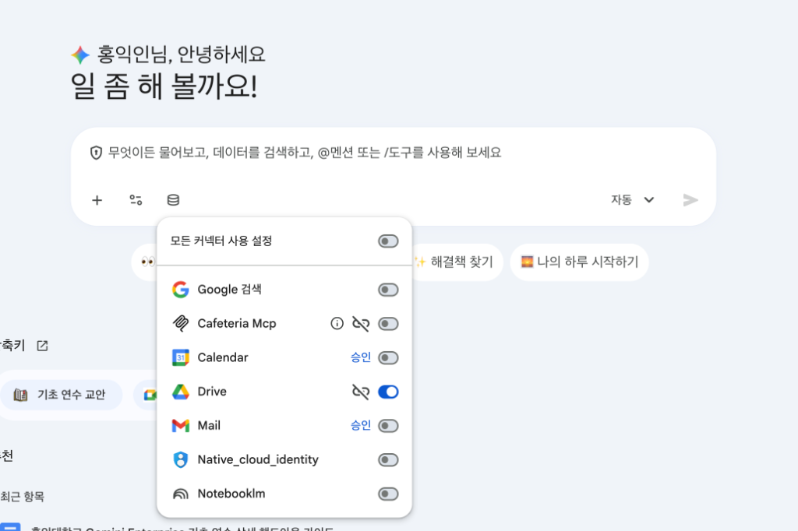
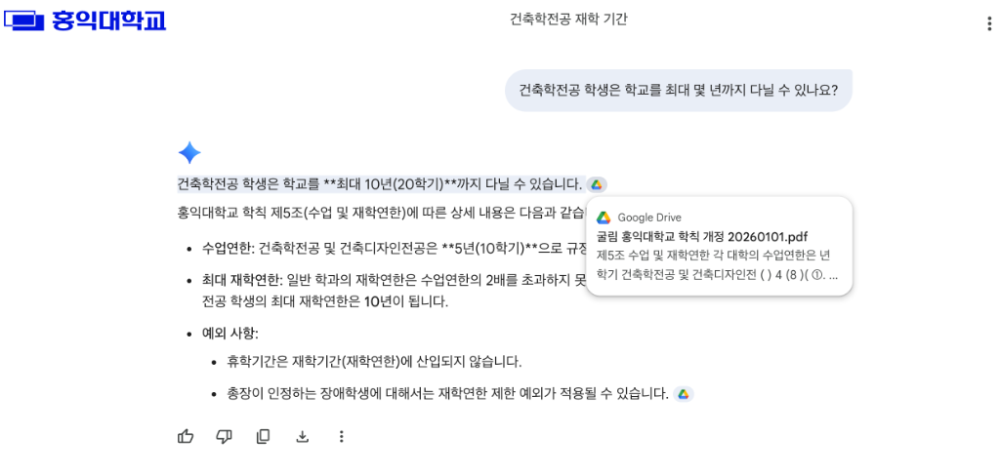
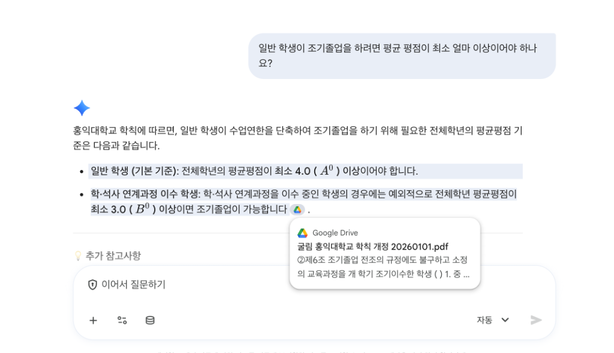

# 📂 실습 나. Search Company Data (문서 검색 및 RAG)

## 1. 실습 목적
* **조직 내부 데이터 연동 및 지식 추출**: 학교 구글 드라이브(공유 드라이브 또는 내 드라이브)에 업로드되어 공유된 문서를 대상으로, 외부 검색 결과가 아닌 **실제 학교 공식 내부 자료**에만 입각하여 안전하고 신속하게 정답을 추론해내는 워크스페이스 연동 기능을 실습합니다.
* **정확한 소스 검증**: AI의 임의 답변(환각 현상)을 방지하고, 답변의 근거가 되는 원본 문서(Sources) 링크를 역으로 확인하는 방법을 익힙니다.

---

## ⚙️ 사전 필수 설정
0. **새 채팅**을 시작합니다.
1. 대화창 하단의 **Google Search** 옵션을 **Off(비활성화)**로 전환합니다.  
   *(학교 내부 보안 문서를 기준으로 답변을 유도하여, 인터넷상의 일반적인 정보를 가져오는 것을 방지합니다.)*
2. 대화창 하단 입력창 왼쪽의 커넥터 아이콘을 클릭하여 **Drive** 연동이 승인 및 활성화되어 있는지 확인합니다.



---

## 🚶‍♂️ 실습 시나리오 및 프롬프트

> [!NOTE]
> **시나리오**: 학사지원팀의 교직원이 되어, 학생들로부터 들어오는 학사 및 규정 관련 문의(건축학전공 재학 연한, 조기졸업 평점 기준 등)에 대하여 구글 드라이브에 공유된 최신 **'홍익대학교 학칙'** 공식 문서를 기반으로 안전하고 신속하게 정확한 답변을 조회하여 안내해야 하는 상황입니다.

### 프롬프트 1: 건축학전공 재학 기간 조회
* **프롬프트**:
  ```text
  건축학전공 학생은 학교를 최대 몇 년까지 다닐 수 있나요?
  ```
* **확인 사항**:
  * 답변 하단의 **"Sources(출처)"** 버튼 또는 파란색 드라이브 아이콘을 클릭하여, 드라이브 내 어떤 학칙 문서 파일(`굴림 홍익대학교 학칙 개정 20260101.pdf` 등)에서 이 정보를 수집했는지 링크를 확인합니다.



---

### 프롬프트 2: 조기졸업 요건 평균 평점 조회
* **프롬프트**:
  ```text
  일반 학생이 조기졸업을 하려면 평균 평점이 최소 얼마 이상이어야 하나요?
  ```
* **확인 사항**:
  * 조기졸업 전조의 규정 중 일반 학생이 수업연한을 단축하여 조기졸업하기 위해 필요한 최소 전체학년 평균 평점이 얼마(4.0 이상)인지와 학·석사 연계과정 이수 학생의 예외 기준(3.0 이상)이 파일 내용과 신뢰도 100%로 일치하여 파악되는지 확인합니다.



---

## 💡 실무 활용 팁 (Tip for Staff)
* **참조(@) 기능 활용**: 입력창에 `@` 키를 누르면 본인의 Google Drive에 저장된 특정 폴더명이나 문서명을 명시적으로 지정하여 검색 대상을 더욱 압축할 수 있습니다. (예: `@홍익대학교_학칙 조기졸업 요건을 알려줘`)

---

## 🔗 다음 실습으로 이동
* [실습 다. Deep Research 바로가기](./03_deep_research.md)
