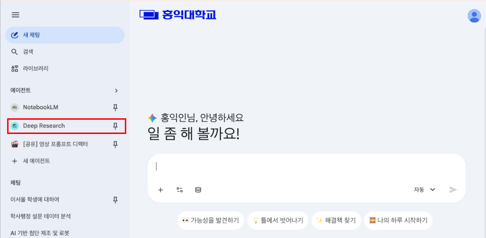
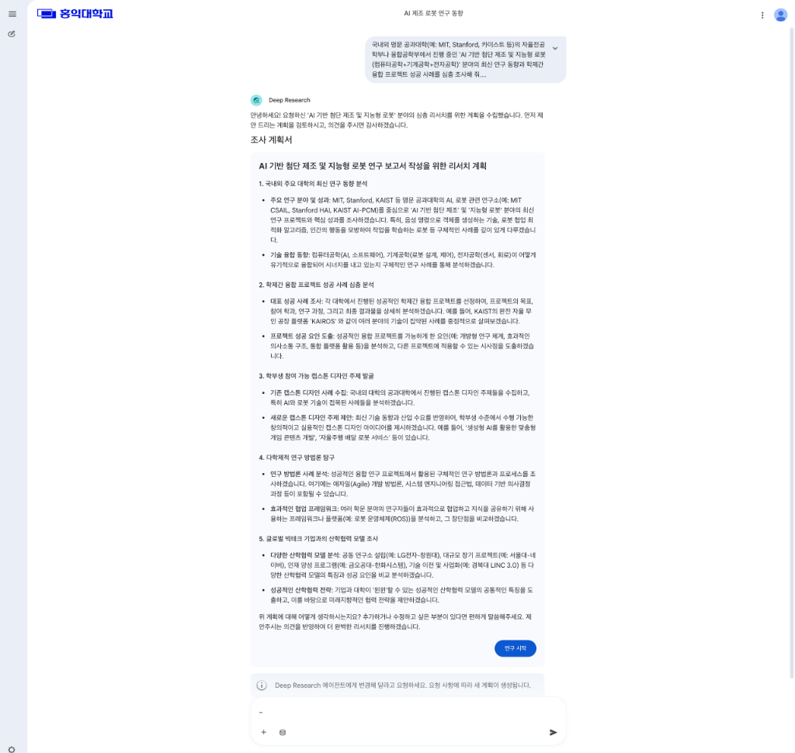
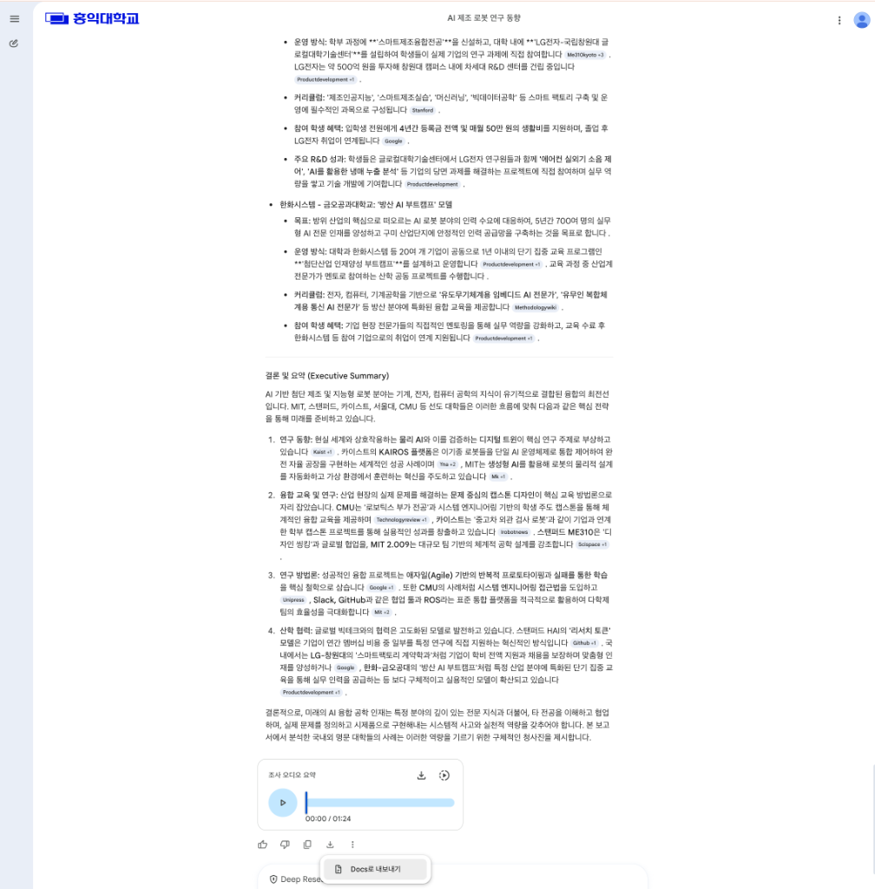

# 🔬 실습 다. Deep Research (글로벌 자율전공 학사 지도 벤치마킹)

## 1. 실습 목적
* **자율 탐색 및 다차원 통합 분석 학습**: 사용자가 한 줄의 질문을 던져도 AI가 수십~수백 개의 국내외 온라인 소스를 스스로 탐색, 비교, 검증하며 정교하고 분량이 방대한 완성형 연구 보고서를 도출하는 **Deep Research(딥 리서치)** 기능의 활용법을 익힙니다.
* **무전공 선발 확대 대처 및 학사 지도 모델 학습**: 최근 대학교 교육 혁신의 최대 화두인 자율전공(무전공) 입학생들의 전공 탐색 지원, 이탈 방지, 그리고 학생 어드바이징(Advising)에 대한 글로벌 혁신 대학들의 실질적 성공 사례를 종합적으로 벤치마킹합니다.

---

## ⚙️ 사전 설정 및 준비
1. 화면 왼쪽 메뉴의 **에이전트** 목록 중에서 **Deep Research**를 클릭하여 선택합니다.  



*(Deep Research는 수십 개의 웹페이지를 실시간으로 크롤링하고 종합하는 고난도 태스크이므로 일반 답변보다 시간이 조금 더 소요될 수 있습니다.)*

---

## 🚶‍♂️ 실습 시나리오 및 프롬프트

> [!IMPORTANT]
> **시나리오**: 대학의 학사기획처 혹은 자율전공학부 지원 부서의 교직원이 되어, 최근 선발 규모가 확대된 무전공(자율전공) 입학생들이 전공을 최종 결정하기 전에 안정적으로 적응하고 주도적으로 진로를 찾도록 돕는 **[글로벌 선진 대학의 무전공 학생 지원 및 학사 지도(Advising) 우수 사례]**를 조사하고자 합니다. 하버드, UC버클리, 미네소타대 등 자율전공 학사 지도가 체계적인 글로벌 명문 대학들의 실제 운영 체계를 바탕으로 깊이 있는 벤치마킹 보고서를 자동 구축합니다.

### 1단계: 실행 프롬프트 입력 및 전송
* **실행 프롬프트**:
  ```text
  글로벌 주요 대학(예: Harvard, UC Berkeley, University of Minnesota 등)에서 무전공(자율전공/Undeclared) 입학생 및 학부 저학년(1~2학년) 학생들을 위해 운영하고 있는 '전공 탐색(Major Exploration) 지원 체계' 및 '학사 지도(Academic Advising) 시스템'의 우수 사례를 심층 조사해줘.
  
  특히 다음 핵심 요소를 포함해서 구체적이고 전문적인 보고서 형식으로 작성해줘:
  1. 학생들이 입학 후 전공을 선택하기 전에 자신에게 맞는 진로를 탐색할 수 있도록 제공하는 대표적인 전공 탐색 프로그램 및 정규 교과목 사례
  2. 전문 어드바이저(Advisor)를 통한 밀착형 학사 지도 운영 방식 및 주도적인 커리어 컨설팅 체계
  3. 무전공 학생들의 소속감 저하나 중도 탈락(이탈) 방지를 위해 대학 차원에서 지원하는 학생 커뮤니티 및 멘토링 프로그램 우수 사례
  
  국내 대학 학사행정에 바로 벤치마킹하여 적용할 수 있도록 실무적이고 체계적인 보고서 형태로 정리해줘.
  ```

---

### 2단계: 조사 계획서 검토 및 연구 시작
1. 프롬프트를 전송하면 Gemini가 심층 리서치에 앞서 탐색 분야와 분석 로드맵이 정리된 **'조사 계획서'**를 먼저 작성하여 제안합니다.
2. 제안된 계획서 내용을 꼼꼼히 확인합니다.
   > [!TIP]
   > 만약 더 보강하고 싶거나 변경이 필요한 연구 영역이 있다면, 하단 대화창을 통해 **"~한 내용을 추가해서 계획서를 변경해줘"**라고 편하게 요청할 수 있습니다. 요청에 맞춰 새롭게 튜닝된 계획서가 다시 제공됩니다.
3. 계획서가 마음에 들면, 계획서 하단의 **[연구 시작]** 버튼을 클릭하여 본격적인 심층 리서치 및 보고서 작성을 개시합니다.



---

## 🔍 결과물 확인 및 드라이브 내보내기

1. **상세 소스 트리(Sources Tree) 및 내용 검토**:
   * Gemini가 실시간으로 수집한 해외 학술지, 명문대 교육과정 공식 문서, 보도자료 등 수십 개의 참고문헌 목록과 인용 부호를 대조하며 완성된 심층 보고서를 검토합니다.
2. **Google Docs로 내보내기 (문서 저장)**:
   * 보고서 출력이 완전히 끝나면 하단의 **[Docs로 내보내기]** 버튼을 클릭합니다.
   * 내보내기 완료 시, 고품질의 서식이 입혀진 완성형 보고서 파일이 **본인의 구글 드라이브(내 드라이브)에 Google Docs(문서) 형식으로 자동 생성되어 저장**됩니다.
   * **중요**: 드라이브에 저장된 이 보고서 파일은 **향후 '실습 라. NotebookLM 활용' 과정에서 개인 맞춤형 리서치 에이전트를 빌드하기 위한 핵심 원천 분석 소스(Source) 데이터로 다시 사용**할 예정이므로 삭제하지 말고 소중히 보관해 주세요.



---

## 🔗 다음 실습으로 이동
* [실습 가. Excel 분석 & PPT 아웃라인 바로가기](./01_excel_analysis.md)
