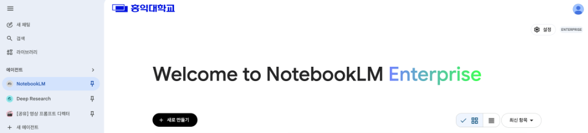
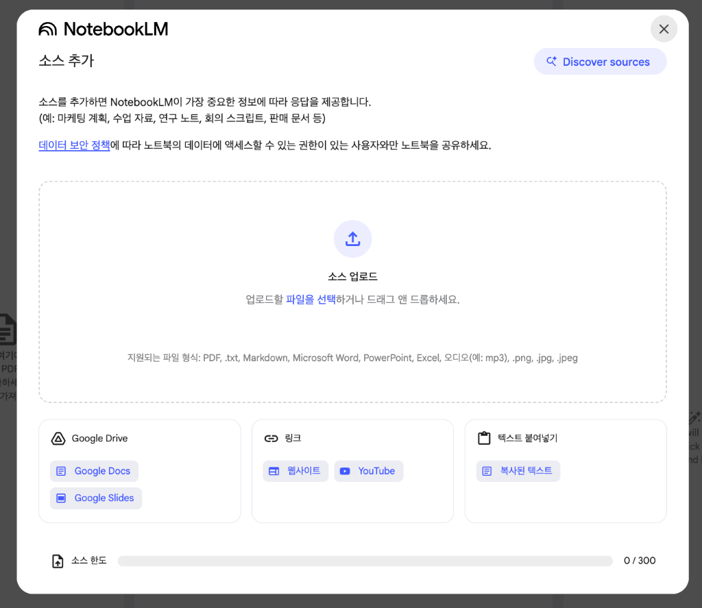
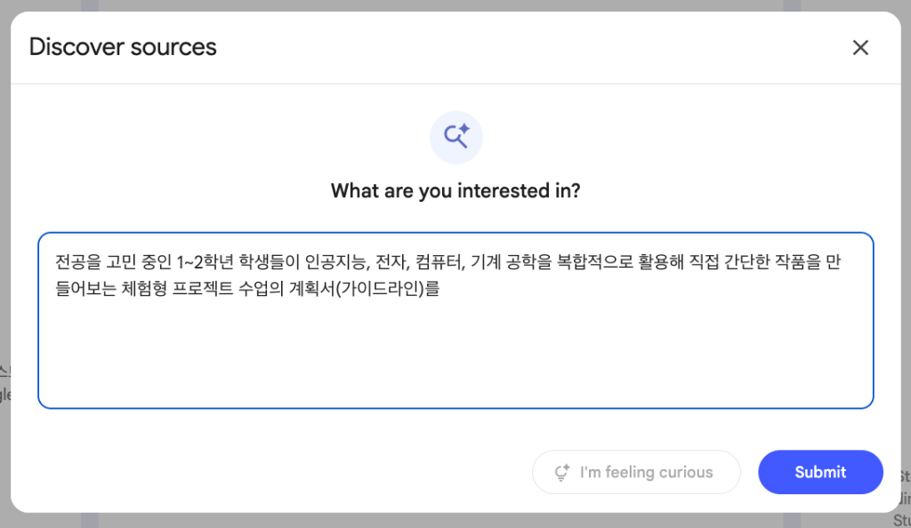
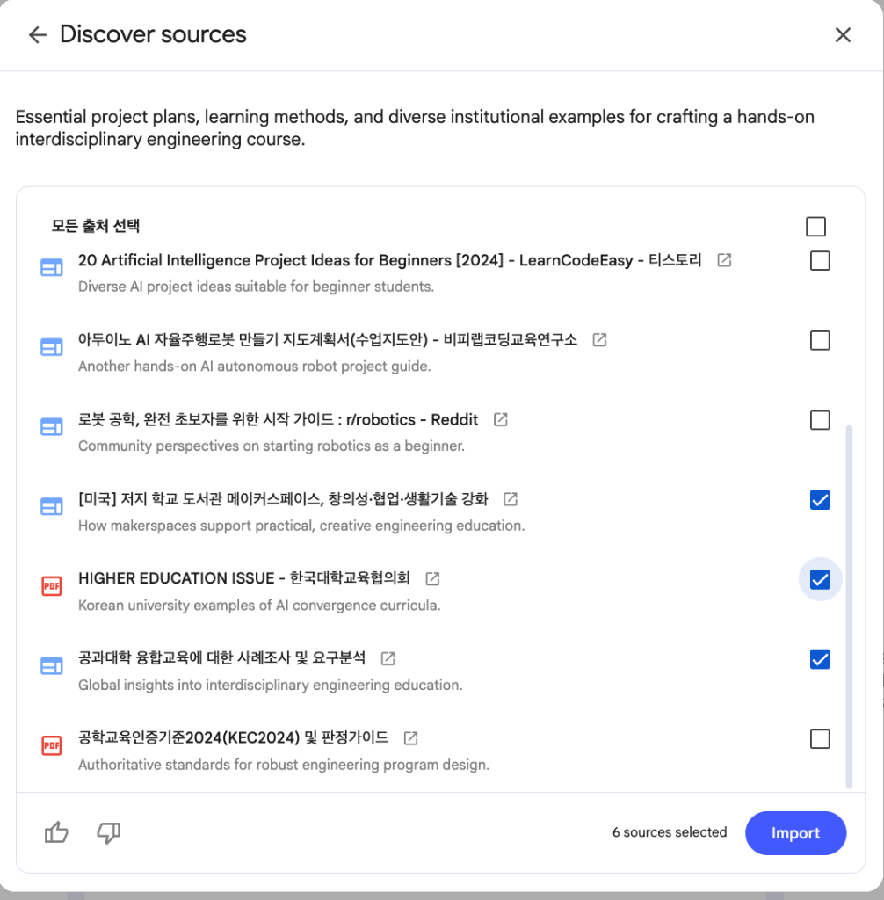
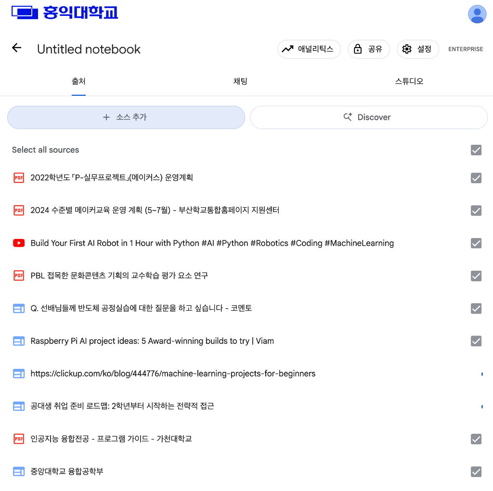
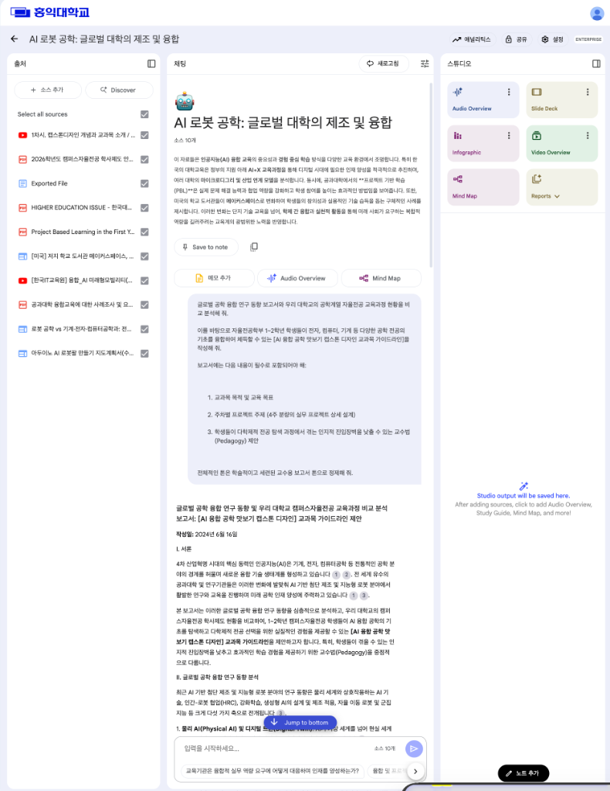
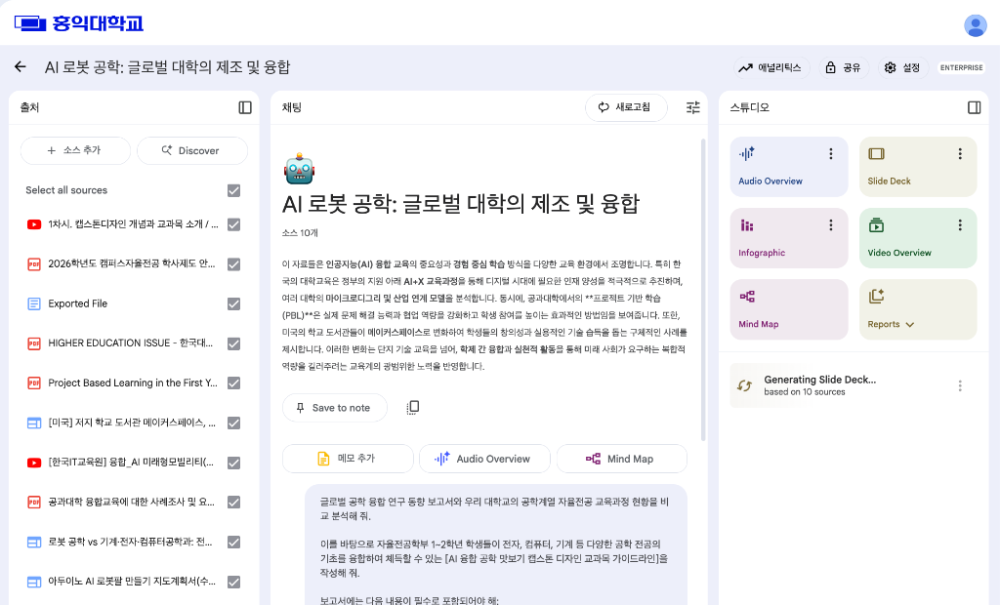
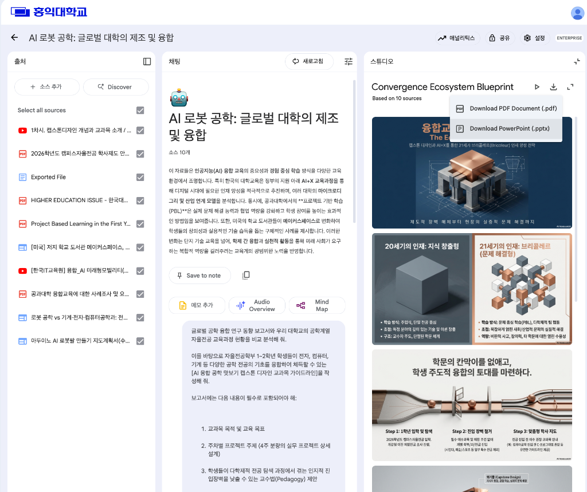

# 📝 실습 라. NotebookLM 활용 (자율전공 전공 탐색 및 학사 지도 설계)

## 1. 실습 목적
* **개인화된 리서치 공간 구축**: NotebookLM을 활용하여 사용자가 제공한 신뢰성 높은 특정 자료(앞선 실습에서 얻은 Deep Research 결과물 + 홍익대학교 실제 학사 규정 등)에만 100% 입각하여 답변하는 학사 기획 및 프로그램 설계 전용 개인 비서를 생성합니다.
* **다양한 소스(멀티 모달) 통합 연구**: 학술 문서뿐만 아니라 유튜브(동영상), 로컬 PDF 안내서 등 다양한 형태의 리소스를 연계하여 입체적인 분석을 수행하는 능력을 습득합니다.
* **실무적이고 정교한 행정 기획 보고서 개발**: AI 기반 지식을 실제 대학교 전공 탐색 교과목 개설 및 구체적인 학생 정착/지도 프로그램 설계안으로 구체화하는 능력을 학습합니다.

---

## ⚙️ 사전 필수 설정
1. 첫 번째 실습이었던 **[실습 다. Deep Research]** 탭으로 돌아가, 백그라운드에서 진행 중이던 심층 리서치 작업이 모두 완료되었는지 확인합니다.
2. 딥리서치 실습 결과물 최하단의 **[Docs로 내보내기]** 버튼을 클릭하여 리포트를 본인의 구글 드라이브(내 드라이브)에 Google Docs(문서) 형식으로 완전히 저장해 둡니다.  
   *(이 저장된 문서 파일이 본 NotebookLM 실습의 핵심 분석 원천 소스(Source)로 연동됩니다.)*

---

## 🚶‍♂️ 실습 시나리오 및 준비 사항

> [!NOTE]
> **시나리오**: 캠퍼스자율전공 지원단 혹은 학사기획팀 교직원이 되어, 글로벌 선진 대학의 우수 사례와 홍익대학교의 실제 자율전공 학사제도를 결합하여 **[홍익대학교 캠퍼스자율전공 신입생 맞춤형 전공 탐색 가이드북 및 밀착형 학사 지도(Advising) 프로그램 실행 설계안]**을 수립하고자 합니다.

### 1단계: NotebookLM 활성화 및 새 노트 생성
1. Gemini Enterprise 화면 좌측 메뉴의 **에이전트(Agents)** 목록에서 **NotebookLM**을 선택하여 호출합니다.



2. 메인 화면에서 **[+ 새로 만들기]** 버튼을 클릭하여 새 노트북(Project)을 개설합니다.

---

### 2단계: 다양한 포맷의 원천 소스(Source) 등록
새로운 노트북이 생성되면 소스 추가(Add Sources) 팝업창이 나타납니다. 이를 통해 멀티모달 소스들을 다차원 연동합니다.



#### 1. Discover Sources 기능 활용
1. 소스 추가 창 우측 상단의 **[Discover sources]** 버튼을 클릭합니다.
2. 어떤 주제에 관심이 있는지 입력하는 검색창(What are you interested in?)에 아래 질문을 입력하고 **Submit**을 누릅니다.
   * **검색어**:
     ```text
     대학교 무전공/자율전공 신입생들이 입학 후 전공 결정 및 대학 생활 적응을 지원하는 전공 탐색 프로그램 및 밀착형 어드바이징(Advising) 설계 가이드
     ```



3. Gemini가 추천해 주는 대학 교육 혁신 및 학사 지도 관련 학술 자료 리스트 중에서 필요한 항목(예: 한국대학교육협의회 보고서, 자율전공 상담 관련 문서 등)들을 체크한 뒤 **[Import]**를 클릭하여 노트로 가져옵니다.



#### 2. 구글 드라이브 문서 추가
1. 소스 추가 창 하단의 **[소스 추가]** (또는 화면 상단의 **[+ 소스 추가]**) 버튼을 클릭하여 소스 팝업창을 다시 엽니다.



2. 소스 창 좌측 하단의 **Google Drive** 영역에서 **[Google Docs]**를 선택합니다.
3. 이전 실습(실습 다. Deep Research)의 최종 결과물로 내 구글 드라이브에 저장된 **'글로벌 주요 대학의 전공 탐색 지원 체계 및 학사 지도 시스템 우수 사례 조사 보고서'**(Google Docs)를 선택해 추가합니다.
   > [!NOTE]  
   > * **주의**: 구글 문서의 파일명은 앞 단계의 딥리서치 생성 엔진에 의해 조금씩 다르게 명명되어 저장될 수 있으므로, 본인의 구글 드라이브에 저장된 학사 지도 보고서를 찾아 유연하게 선택해 주시면 됩니다.
   > * **💡 실습 시간 부족을 위한 대체 가이드 (백업 방안)**:  
   >   만약 실습 시간 부족이나 일시적인 네트워크 장애로 인해 딥리서치 결과 보고서가 본인 드라이브에 아직 최종 생성되지 않았다면, 본 저장소의 [전공 탐색 및 학사 지도.docx](./../data/전공%20탐색%20및%20학사%20지도.docx) 파일을 마우스 우클릭하여 로컬 컴퓨터에 다운로드합니다. 그 후 아래의 **"4. 로컬 PDF 안내서 업로드"** 가이드라인과 동일하게 이 Word(`.docx`) 파일을 소스 영역으로 끌어다 놓아 직접 업로드하여 실습을 성공적으로 진행할 수 있습니다.

#### 3. 외부 멀티미디어(유튜브) 링크 추가
1. 소스 창 중간 하단의 **링크** 영역에서 **[YouTube]**를 클릭합니다.
2. 대학 무전공 제도 및 학사 밀착 어드바이징, 멘토링 프로그램과 관련된 다음의 두 동영상 주소를 각각 입력하여 소스로 등록합니다:
   * **유튜브 링크 1**: `https://www.youtube.com/watch?v=qy33wu-DLWk`
   * **유튜브 링크 2**: `https://www.youtube.com/watch?v=wT37Q5UuGXw`

#### 4. 로컬 PDF 안내서 업로드
1. 본 실습 저장소의 `data/2026학년도 캠퍼스자율전공 학사제도 안내.pdf` 경로에서 파일을 다운로드하여 컴퓨터 로컬에 임시 저장합니다.
2. 소스 추가 창의 **소스 업로드** 영역(`파일을 선택하거나 드래그 앤 드롭`)을 클릭하여, 다운로드한 PDF 파일을 업로드합니다.

> [!TIP]
> 모든 소스가 등록되면 화면 왼쪽 **출처(Sources)** 목록에 풍부한 지식 소스들이 등록 및 선택되어 있는 것을 확인할 수 있습니다.



---

### 3단계: 전공 탐색 가이드북 및 학사 지도 프로그램 생성
등록된 풍부한 자료(심층 학술 동향 보고서 + 홍익대학교 학사제도 + 전공 지도 관련 유튜브)들을 바탕으로 본교 실정에 부합하는 맞춤형 가이드라인과 어드바이징 체계를 모델링합니다.

* **실행 프롬프트**:
  ```text
  글로벌 자율전공 학사 지도 연구 보고서(Deep Research 결과)와 첨부한 '홍익대학교 캠퍼스자율전공 학사제도 안내' PDF 파일을 분석 및 대조하여, 우리 대학교의 현황을 정밀히 진단하고 개선책을 마련해줘.
  
  이를 바탕으로 홍익대학교 캠퍼스자율전공 1~2학년 학생들이 성공적으로 적응하고 주도적으로 전공을 탐색할 수 있도록 돕는 [홍익대학교 캠퍼스자율전공 전공 탐색 가이드북 및 밀착형 학사 지도(Advising) 프로그램 실행 계획서]를 작성해줘.
  
  계획서에는 다음 내용이 세련되고 구조적으로 포함되어야 해:
  1. 홍익대학교 학사제도의 강점 및 보완점 (글로벌 우수 사례와의 비교 분석)
  2. 홍익대학교 맞춤형 신입생 전공 탐색 핵심 교과목 및 워크숍 운영 안 (학기별 4단계 로드맵)
  3. 전공 미결정 학생들의 이탈 방지 및 소속감 강화를 위한 '홍익대 밀착형 어드바이징(Advising) 및 선배 멘토링 체계' 세부 운영 시나리오
  
  실무 보고용의 정제되고 설득력 있는 행정 보고서 톤으로 작성해줘.
  ```

---

## 💡 추가 활동 가이드 (Extra Activity)

1. **오디오 요약(Audio Overview) 생성**:
   * **Audio Overview**를 눌러 위 가이드라인을 주제로 두 명의 진행자가 재치 있게 영어로 대화하는 딥러닝 오디오 팟캐스트 요약을 생성해 보세요.
2. **스튜디오(Studio)에서 슬라이드 덱(Slide Deck) 장표 생성**:
   * 우측 스튜디오 메뉴에서 **"Slide Deck"**을 클릭하여 발표용 장표 생성을 개시해 보세요. 
   * **주의**: 슬라이드 덱 생성은 자료 전체를 장표 포맷으로 변환 및 모델링하므로 **시간이 다소 소요될 수 있습니다.** 슬라이드 생성을 눌러두신 후, 백그라운드에서 진행되는 동안 곧바로 다음 실습 세션으로 이동해 보세요!



   * 슬라이드 장표 생성이 완료되면 고품질의 완성형 프레젠테이션 프리뷰가 우측에 노출되며, 우측 상단의 다운로드 아이콘을 통해 **구글 슬라이드(PowerPoint) 포맷 또는 PDF 문서**로 다운로드하여 소장할 수 있습니다.



---

## 🔗 다음 실습으로 이동
* [실습 마. MCP 서버 사용 바로가기](./05_mcp_server.md)
