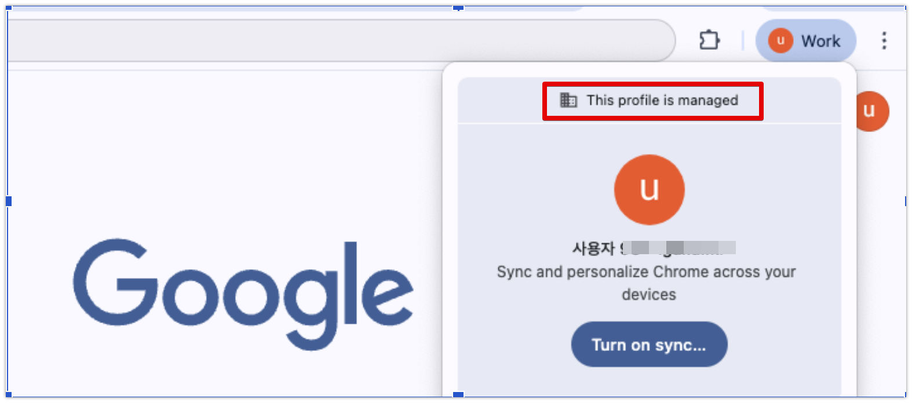
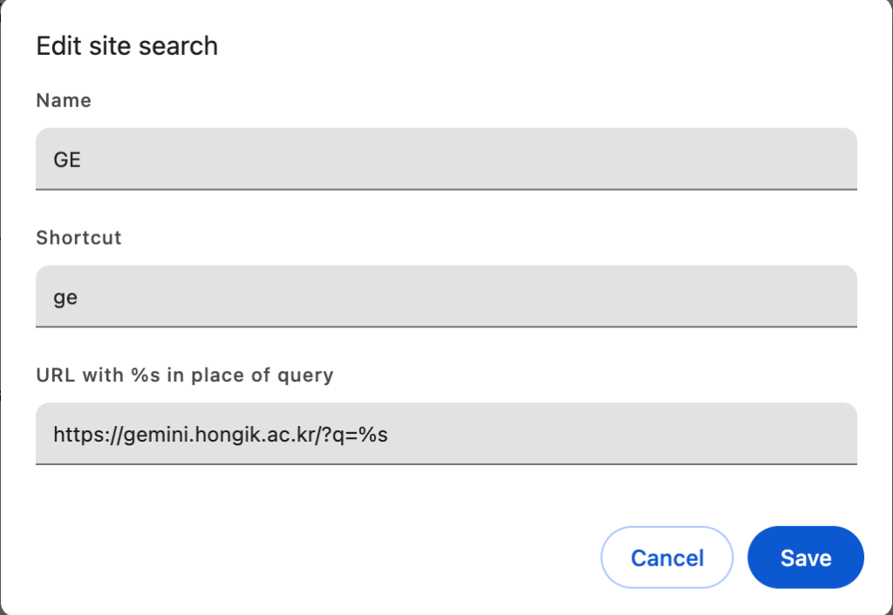
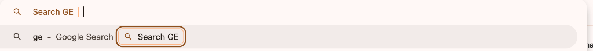

# 🌐 실습 바. Chrome Integration (크롬 브라우저 연동)

## 1. 실습 개요
* **브라우저 기반 빠른 작업 진입**: 매번 Gemini Enterprise 사이트에 직접 접속할 필요 없이, Google Chrome 브라우저의 주소창(Omnibar)에서 단축어로 직접 인공지능에 질의를 보내서 즉시 작업을 처리하는 연동 방법을 익힙니다.

---

## 🚶‍♂️ 실습 시나리오 및 수행 단계

> [!NOTE]
> **시나리오**: 웹서핑이나 행정 업무를 처리하던 도중, 별도의 탭을 열고 Gemini 사이트를 검색해서 이동하는 번거로움 없이 주소창 검색어를 사용하여 리눅스 특정 포트 종료 명령어를 즉시 조회해 봅니다.

### 1단계: Chrome 프로필 로그인 및 확인
1. Chrome 브라우저를 실행합니다.
2. 새로운 Chrome 프로필(Profile)을 만들고, 부여받은 Google Workspace 계정으로 로그인합니다.
3. 브라우저 오른쪽 상단에 해당 학교 계정 프로필로 로그인 되었는지 확인합니다.



---

### 2단계: 크롬 사이트 검색(Site search) 설정 추가
1. Chrome 브라우저를 열고 주소창에 `chrome://settings/searchEngines`를 입력하여 검색엔진 설정 페이지로 이동합니다.
2. **사이트 검색(Site search)** 섹션 우측의 **추가(Add)** 버튼을 클릭합니다.
3. 검색창 추가(Edit site search) 팝업창에 아래 정보를 그대로 입력한 후 **저장(Save)** 버튼을 누릅니다.
   * **이름 (Name)**: `GE`
   * **단축키 (Shortcut)**: `ge`
   * **URL (URL with %s in place of query)**: `https://gemini.hongik.ac.kr/?q=%s`



---

### 3단계: 주소창(Omnibar)에서 즉시 질의 수행
1. Chrome 브라우저 주소창에 단축키인 `ge`를 입력한 후, 키보드의 **Tab** 키 또는 **Space bar**를 누릅니다.
2. 주소창이 **"Search GE"** 상태로 변경되는 것을 확인합니다.



3. 이어서 바로 질문 프롬프트를 입력하고 **Enter**를 누릅니다.
   ```text
   리눅스에서 특정 포트(예: 8080) 사용 중인 프로세스 찾아서 종료하는 명령어 알려줘
   ```
4. 엔터를 누르면 홍익대학교 전용 Gemini Enterprise 화면으로 다이렉트 연동되어, 질문에 대한 명쾌한 해답과 가이드를 즉시 얻을 수 있습니다!

---

## 🎉 축하합니다!
**이로써 홍익대학교 교수진 및 임직원을 위한 Gemini Enterprise 핸즈온 워크숍의 모든 실습(가~바 과정)을 성공적으로 마쳤습니다.**  
본 실습을 기반으로 행정 업무 자동화, 정교한 학생 데이터 수집, 수준 높은 다학제 융합 연구 및 최신 교수 설계에 Gemini Enterprise를 200% 활용해 보세요!
